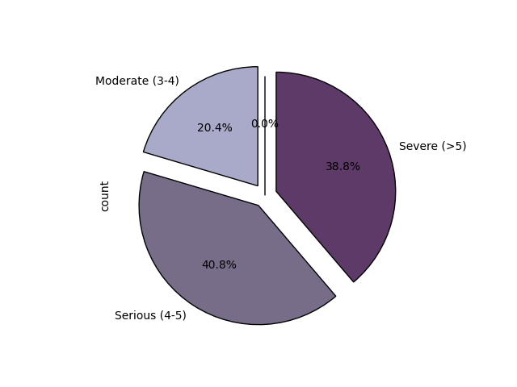

# US Housing Affordability Analysis and Prediction

## Overview
This project analyzes the relationship between **essential living costs** and **housing affordability** in the United States.  
Households are increasingly challenged by rising expenses, making affordability a sensitive issue to address.  

Using open-source datasets the project investigates:

**How do essential living expenses impact the ability of U.S. households to afford housing?**

---

## Objectives
1. Explore cost-of-living data and correlate it with household incomes across U.S. states.  
2. Analyze housing costs and measure the affordability burden for households.  
3. Apply predictive modeling to forecast affordability trends and housing-related stress.  

---

## Repository Structure
```
.
├─ README.md                # project documentation
├─ requirements.txt         # dependencies
├─ LICENSE                  # license
│
├─ src/                     # Python source code
│   ├─ data_analysis.py     # main exploratory analysis
│   └─ pipeline.py          # end-to-end workflow
│
├─ scripts/                 # shell scripts
│   ├─ pipeline.sh          # wrapper to run pipeline
│   └─ tests.sh             # test runner
│
├─ tests/                   # testing
│   └─ test_pipeline.py     # basic checks for pipeline
│
├─ reports/                 # outputs and deliverables
│   ├─ analysis-report.pdf  # technical analysis
│   ├─ data-report.pdf      # dataset documentation
│   └─ slides.pdf           # project presentation
│
└─ docs/                    # supporting documents
    ├─ project-plan.md      # planning document
    └─ presentation-video.md# notes / script
```

---
## Key Formulas

### Essential Cost of Living to Income Ratio (ECLIR)

$$
\mathrm{ECLIR}(area) = \frac{\text{Median Essential Living Expenses}}{\text{Median Household Income}} \times 100
$$

This ratio measures the percentage of a **typical** household's income spent on essential living costs.

### Housing Cost Burden (HCB)

$$
\mathrm{HCB}(area) = \frac{\text{Median Housing Expenses}}{\text{Median Household Income}} \times 100
$$

Housing is considered affordable if HCB ≤ 30%. Higher values indicate households are housing-burdened.

### Price-to-Income Ratio (PIR)

$$
\mathrm{PIR}(state) = \frac{\text{Median House Price}}{\text{Median Annual Household Income}}
$$

The PIR measures the housing affordability by comparing the house market prices with household incomes.

---  

## Key Results   

   
*Essential cost of living ratio across U.S. states.*  

   
*Distribution of PIR across U.S. states.*

---  
## Methods
- **Data Cleaning & Preprocessing** of datasets  
- **Exploratory Data Analysis (EDA)** with visualization  
- **Predictive Modeling** of affordability metrics  
- **Correlation Analysis** between living expenses and household income  

---

## Tools & Technologies
- Python (pandas, sqlalchemy, sqlite3, json, scikit-learn, matplotlib, seaborn)  
- Jupyter Notebook / VS Code  
- Shell scripting (pipeline automation)  

---

## Quickstart

Clone this repository:
```bash
git clone https://github.com/xhensilahoxha/US-Housing-Affordability-Analysis-and-Prediction.git
cd US-Housing-Affordability-Analysis-and-Prediction
```

Create a virtual environment and install dependencies:
```bash
python -m venv .venv
source .venv/bin/activate   # Linux/Mac
.venv\Scripts\activate      # Windows PowerShell

pip install -r requirements.txt
```

Run the full pipeline:
```bash
python pipeline.py
```

Or use the shell wrapper:
```bash
bash pipeline.sh
```

---

## Data Sources
The datasets used in this project were retrieved from **Kaggle** and adapted for analysis:
- [US Cost of Living Dataset](https://www.kaggle.com/datasets/asaniczka/us-cost-of-living-dataset-3171-counties)  
- [US House Listings Dataset](https://www.kaggle.com/datasets/febinphilips/us-house-listings-2023)  

---

## Testing
Run lightweight checks:
```bash
python test.py
bash tests.sh
```

---

## License
This project is released under the [MIT License](LICENSE).

---

## Acknowledgements
This work was carried out as part of the **Methods of Advanced Data Engineering (MADE)** module at **FAU Erlangen-Nürnberg**.
